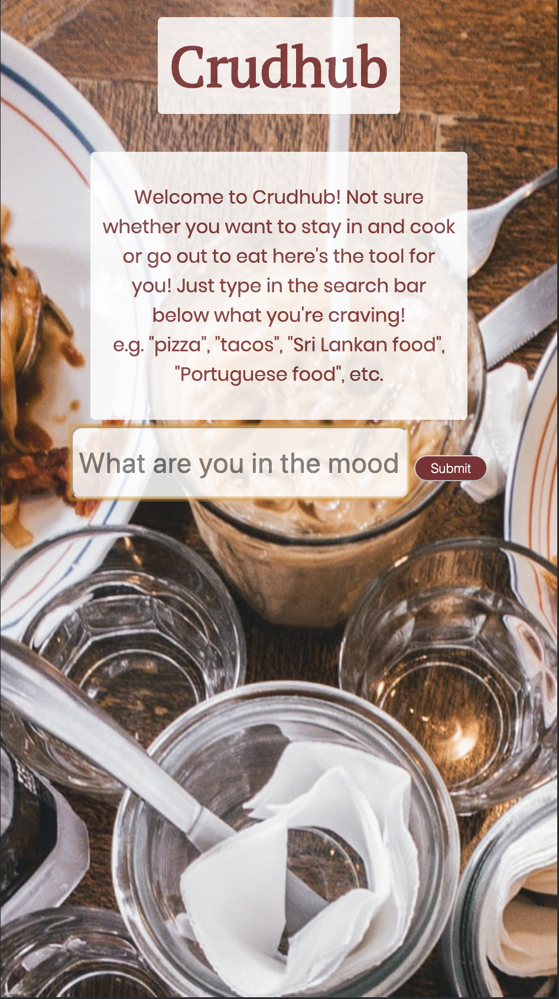
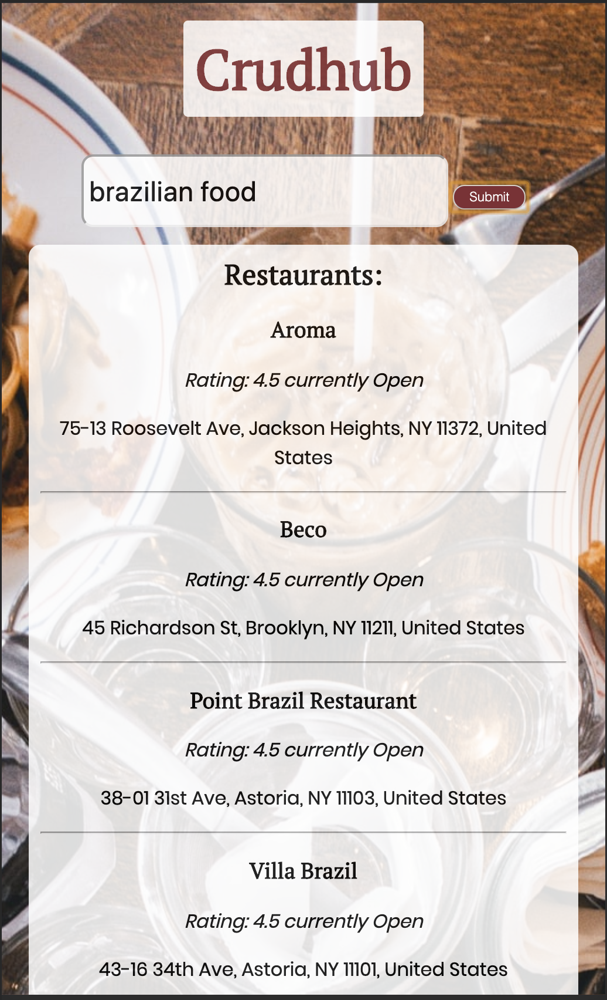

# Crudhub

link: https://nasjones.github.io/Crudhub/

Summary: The app utilizes the edamam api and the google locations api so that when the user inputs what type of food they want
the edamam api searches recipes for that type of food and the google places api searches for restaurants that offer that type 
of food and returns both in a list of options the restaurants within half a mile with a rating and whether or not the restaurant is currently opened 
and the recipes with the ingredients and a link to the full recipe.

Technology used: HTML, CSS, JavaScript, and jQuery
